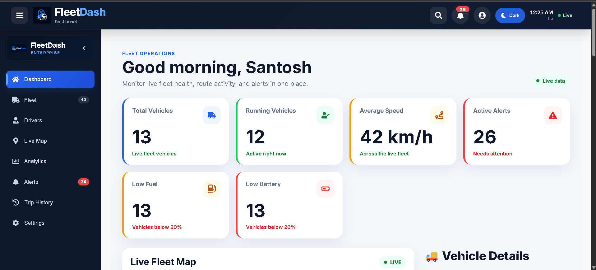

````markdown
# FleetDash 🚗

A full-stack fleet management dashboard for monitoring vehicles, managing fleet data, and visualizing operational information through an interactive and responsive interface.

FleetDash is built with the MERN stack and provides a centralized dashboard for vehicle management, live map visualization, analytics, alerts, and reporting.

## 🚀 Features

### 📊 Dashboard
- Fleet overview and vehicle statistics
- Interactive analytics and charts
- Vehicle status monitoring
- Responsive dashboard layout

### 🗺️ Live Fleet Map
- Interactive vehicle map using Leaflet
- Vehicle location visualization
- Vehicle status indicators
- Real-time map updates

### 🚘 Vehicle Management
- Add new vehicles
- Edit vehicle information
- Delete vehicles
- View vehicle details
- Vehicle status management

### 🔔 Alerts & Monitoring
- Vehicle monitoring
- Overspeed and low-fuel alert handling
- Real-time alert updates
- Alert status visualization

### 🔐 Authentication
- JWT-based authentication
- Protected application routes
- Secure API access

### 📈 Analytics
- Fleet performance visualization
- Vehicle-related statistics
- Interactive charts using Recharts

### 📄 Reports
- Export fleet information to PDF
- Export data to Excel
- Generate reports from dashboard data

### 🎨 UI / UX
- Responsive design
- Dark mode
- Clean dashboard interface
- Mobile-friendly layout

---

## 🛠️ Tech Stack

### Frontend

- React.js
- TypeScript
- Redux Toolkit
- Tailwind CSS
- Leaflet
- Recharts
- Axios

### Backend

- Node.js
- Express.js
- REST APIs
- JWT Authentication

### Database & Real-Time

- MongoDB
- Mongoose
- Socket.io
- Redis

### Tools

- Git
- GitHub
- VS Code
- Postman

---

## 🏗️ Project Structure

```text
FleetDash/
│
├── client/
│   ├── src/
│   ├── components/
│   ├── pages/
│   ├── services/
│   └── ...
│
├── server/
│   ├── controllers/
│   ├── models/
│   ├── routes/
│   ├── services/
│   └── ...
│
└── README.md
````

---

## ⚙️ Getting Started

### Prerequisites

Make sure the following are installed:

* Node.js
* npm
* MongoDB
* Redis

### 1. Clone the repository

```bash
git clone https://github.com/kalesantosh665/FleetDash.git

cd FleetDash
```

### 2. Install frontend dependencies

```bash
cd client
npm install
```

### 3. Install backend dependencies

Open another terminal:

```bash
cd server
npm install
```

### 4. Configure environment variables

Create a `.env` file inside the `server` directory.

Example:

```env
PORT=5000
MONGO_URI=your_mongodb_connection_string
JWT_SECRET=your_jwt_secret
REDIS_URL=your_redis_connection_string
```

> Do not commit real credentials or secrets to GitHub.

### 5. Start the backend

```bash
cd server
npm run dev
```

### 6. Start the frontend

```bash
cd client
npm run dev
```

The application will then be available through the local development URL shown by Vite.

---

## 🔄 Application Architecture

```text
                   ┌─────────────────────┐
                   │      React Client    │
                   │                     │
                   │ Dashboard / Map /   │
                   │ Charts / CRUD / UI  │
                   └──────────┬──────────┘
                              │
                    REST API / Socket.io
                              │
                              ▼
                   ┌─────────────────────┐
                   │    Node.js Server   │
                   │     Express.js      │
                   └───────┬─────┬───────┘
                           │     │
                ┌──────────┘     └──────────┐
                ▼                           ▼
        ┌───────────────┐          ┌───────────────┐
        │    MongoDB    │          │     Redis     │
        │ Persistent DB │          │ Real-time     │
        │               │          │ Messaging     │
        └───────────────┘          └───────────────┘
```

---

## 🧠 Key Technical Concepts

### Real-Time Communication

Socket.io is used to establish real-time communication between the frontend and backend for live vehicle and alert updates.

### Redis

Redis is used as a fast in-memory layer for real-time messaging and frequently accessed data.

### MongoDB

MongoDB provides persistent storage for fleet-related information such as vehicles, trips, and alerts.

### JWT Authentication

JWT-based authentication is used to protect API endpoints and restrict access to authenticated users.

---

## 📸 Screenshots

Add screenshots of the following application views here:

### Dashboard



### Live Map


### Vehicle Management


### Alerts


---

## 🎯 Project Goals

FleetDash was developed to demonstrate practical full-stack development concepts including:

* Modern React application development
* REST API design
* Real-time communication
* Database integration
* Authentication and authorization
* Data visualization
* Responsive UI development
* CRUD application architecture
* Git-based development workflow

---

## 🔮 Future Improvements

Possible future enhancements include:

* Role-based access control
* Advanced fleet analytics
* Route history and playback
* Vehicle maintenance scheduling
* Automated notifications
* Docker-based deployment
* Cloud deployment
* Automated testing and CI/CD

---

## 👨‍💻 Author

**Santosh Kale**

Frontend / Full-Stack Developer

* GitHub: https://github.com/kalesantosh665
* LinkedIn: https://www.linkedin.com/in/santosh-kale-233725321/
* Portfolio: https://kalesantosh665.github.io/portfolioo/

---

## 📄 License

This project is intended for learning, portfolio, and demonstration purposes.

```
```
